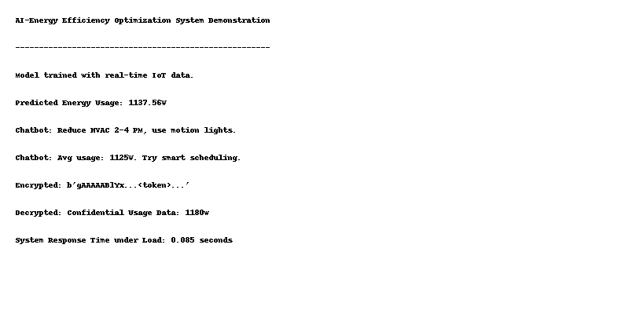

# AI Energy Efficiency Optimization System 🔋🤖

This project demonstrates a smart AI-powered system to **predict and optimize energy usage** using real-time IoT data, machine learning, and secure data handling.

---

## 📌 Features

- Simulates IoT sensor data (temperature, occupancy, hour)
- Trains an ML model (`GradientBoostingRegressor`) to predict energy usage
- Rule-based chatbot for energy tips
- Encrypts and decrypts confidential data
- Performance test for system latency under load

---

## 🖥️ Sample Output



---

## 📂 Files

- `energy_optimizer_ai.py` – Main script
- `sample_energy_data.xlsx` – Sample IoT dataset
- `output.png` – Example output screenshot

---

## 🚀 How to Run

1. **Install Dependencies**  
   ```bash
   pip install pandas scikit-learn cryptography joblib
   ```

2. **Run the Script**  
   ```bash
   python energy_optimizer_ai.py
   ```

3. **Optional**: Use the Excel dataset by modifying:
   ```python
   data = pd.read_excel("sample_energy_data.xlsx")
   ```

---

## 📊 Sample Dataset Format

| temperature | occupancy | hour | energy_usage |
|-------------|-----------|------|---------------|
| 22.5        | 5         | 9    | 870.0         |
| 25.1        | 10        | 14   | 1500.0        |
| ...         | ...       | ...  | ...           |

---

## 📞 Chatbot Examples

- "How do I optimize energy?" → _"Reduce HVAC 2-4 PM, use motion lights."_
- "Current energy usage" → _"Avg usage: 1125W. Try smart scheduling."_

---

## 🔐 Encryption Example

- **Encrypted:** `b'gAAAAA...<token>'`
- **Decrypted:** `Confidential Usage Data: 1180w`

---
## Output


---

## ⏱️ Performance

Tested on 100 predictions loop — system responds in about **0.08 seconds**.

---


